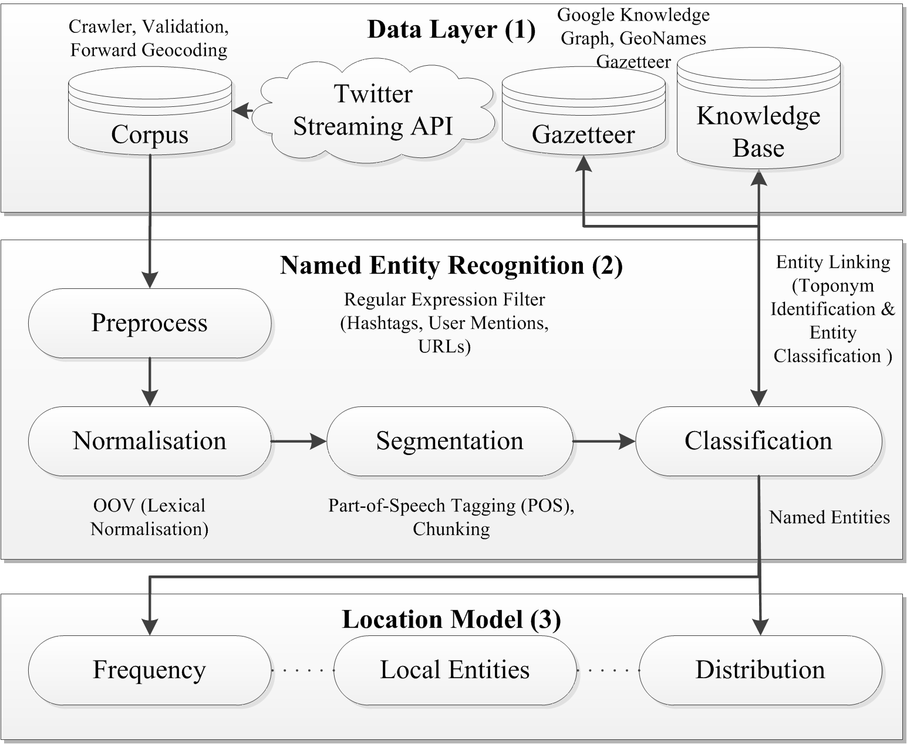

# location-inference

## Abstract
Current content-based approaches to location inference on Twitter have relied on individual words to derive context; oftentimes yielding ineffective results. Our goal is to extract meaningful named entities which are highly valuable for location inference, while limiting the impact of inherent noise from the vast range of topics present in tweets; given such information, we aim to estimate user’s home locations with greater accuracy over existing word-based techniques. In this paper, a system is proposed to jointly extract named entities and evaluate their geographic distribution. Our approach employs a retrained Conditional Random Field (CRF) model supported by part-of-speech (POS) tagging and leverages information from geographic databases alongside the state-of-the-art Google Knowledge Graph for entity linking. The extracted entities are provided as features to a Gaussian Mixture Model to assess spatial distribution. Additionally, we present a comprehensive dataset of Twitter users from across the United Kingdom and Ireland which available to the research community at request. Results show that named entities preserve tweet semantics more precisely than individual words and can further disambiguate terms, suggesting an encouragingly novel approach that promises to improve the accuracy and granularity of home location inference.

## Problem Statement
Our goal is to estimate the home location of Twitter users based purely on the content of their tweets. The objective of our work can be summarised in the following problem statement:
Given a set of tweets T(u) = {t1, …, t|T(u)|} posted by user u, where ti is a message of up to 140 characters, and a set of candidate cities, C, estimate the most likely c ∈ C such that c is the home location of u.
We propose to extract a set of named entities from T(u) which can be used to explore the potential benefits over existing word-based alternatives.

|ID|Research Question|Motivation|
|---|---|---|
|RQ1|Can local entities improve the effectiveness of location estimation over local word usage?|Determine if entities improve upon existing word models|
|RQ2|Which entities are most effective in the estimation of a user’s location?|Identify entities that exhibit local usage patterns|
|RQ3|How does the effectiveness of content-based location inference vary across geographic regions?|Assess the impact of geography on the effectiveness of estimation and evaluate the external validity of findings|

The primary research question is RQ1. Our intuition is that local entities can improve upon existing word-based approaches in location inference. Towards answering this research question, we propose to assess the impact of local entities on both the accuracy and granularity of home location estimation. The following null and alternative hypotheses are suggested for experimental settings:

> H0: Local entities do not improve the effectiveness of location prediction over the use of local words.
> 
> H1: Local entities improve the effectiveness of location prediction over local word usage.

RQ1 and RQ2 are targeted to identify entities which are highly valuable for location inference. An understanding of types presenting noise to location inference systems highlight increased effectiveness from their removal i.e. are place names present across a significant number of users? If so, is there a hierarchy of entity types such that certain entities should be considered more locally significant than others? Interestingly, targeted local entities as described may offer efficiency and applicability to users with fewer tweets.
Finally RQ3 suggests comparing different geographic regions; in summary, larger geographic regions could be expected to have greater variation in local dialect and user interests than compact regions. Comparing corpora helps assesses external validity.

## Solution Architecture

_Figure 1 - Overview of proposed solution._

_Figure 2 - Named Entity Recognition (NER) solution._

## Conclusions
In this paper, we have described a general framework capable of inferring the home location of Twitter users through content-based methods.
Our contributions include the creation of a comprehensive and novel dataset of Twitter users and their associated tweets from across the United Kingdom and Ireland; and further, constructed an annotated corpus for the evaluation of named entity recognition performance which is available at request to the research community. We have developed a system capable of extracting named entities from tweets using a retrained model supported by part-of-speech tagging and a gazetteer for the identification of geographic entities, which leverages information from the state-of-the-art Google Knowledge Graph for entity linking with unclassified entities. When the extracted entities are provided as features into a location model, results show our best performing model to place 45% of users UK users within 93km of their home location.
This work has highlighted challenges posed to location inference on Twitter and investigated various content-based approaches to address such issues; the reviewed work highlights that named entity recognition and content-based location inference have been approached as two distinct domains. We have identified and presented a promisingly novel approach to address the issues of word-based models by extracting meaningful entities which are highly valuable for location inference. 
Twitter, as with social media in general, is an ever growing platform which offers vast scope for future work; we believe that many clues remain hidden within tweet content waiting to be discovered. In a purely content-based approach, we suggest a greater exploration into the hashtag field which was seen to exhibit many geospatial clues with potential to enhance existing techniques.
